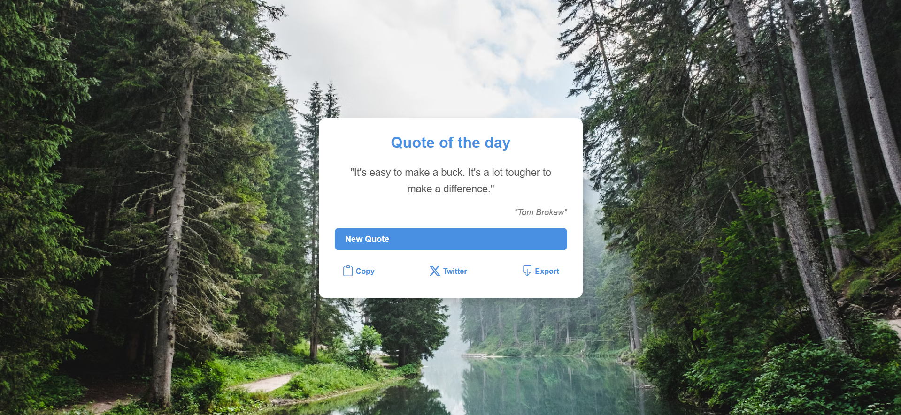

# **Quote Generator**

Quote Generator is a web-based platform that provides randomly generated quotes to inspire and uplift users. With a simple click, users can copy quotes to their clipboard for easy sharing. Additionally, users can post quotes directly to Twitter. Each new quote is accompanied by a randomly selected background image, enhancing the overall experience with a fresh and dynamic look

## **Features**

- **Random Quote Generation** – Instantly generate inspiring, thought-provoking, or motivational quotes with a single click.

- **Clipboard Copy** – Easily copy quotes to your clipboard for seamless sharing anywhere.

- **Twitter Integration** – Share quotes directly to Twitter with a simple button click.

- **Dynamic Backgrounds** – Each new quote is displayed with a fresh, randomly selected background image for a visually engaging experience.

- **User-Friendly Interface** – Clean, minimal, and intuitive design for effortless navigation.

## **API endpoint**

- API link: [**API**](https://api.freeapi.app/api/v1/public/quotes/quote/random)
- API Docs: [**FreeAPI Guide**](https://freeapi.hashnode.space/api-guide/apireference/getARandomQuote)

## **Deployment Link**

Access YTMasterJi here: [**Live Demo**](#)

## **Screenshots**



## **Technologies Used**

- HTML
- CSS
- JavaScript
- FreeAPI Random Quote Generator

## **Installation & Setup**

To run this locally, follow these steps:

1. **Clone the Repository:**
   ```sh
   git clone https://github.com/your-username/Random-Quote-Generator.git
   ```
2. **Navigate to the folder:**
   ```sh
   cd Random-Quote-Generator
   ```
3. Open: the below file in the browser
   ```sh
   index.html
   ```
